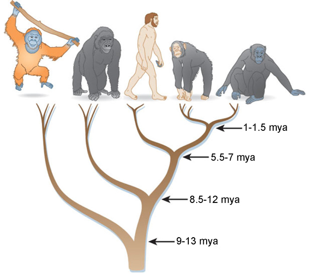
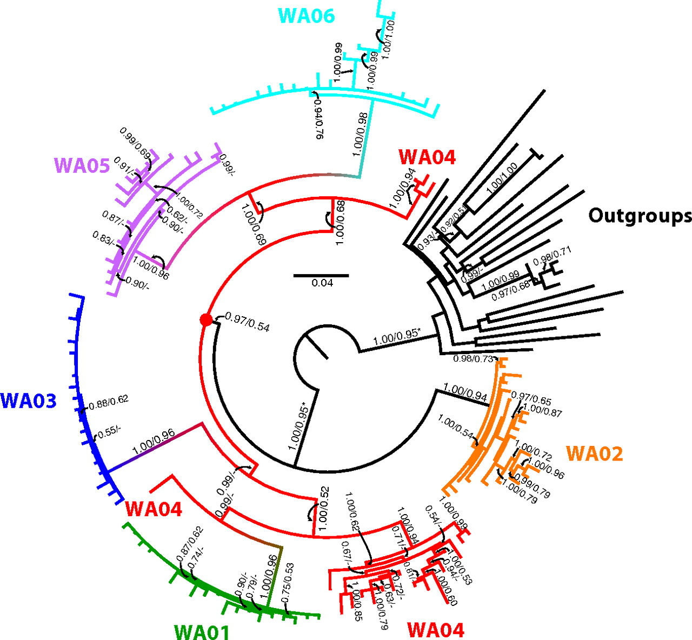
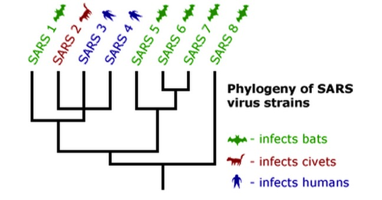
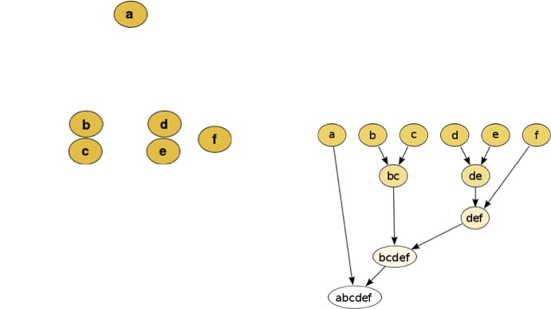

```{r setup, include=FALSE}
knitr::opts_chunk$set(fig.align="center",echo = TRUE)
options(Encoding="UTF-8")
```

## Schedule
###First part of the course (michael.blum@univ-grenoble-alpes.fr) is about how to build phylogenetic trees based on DNA sequences. You will have to work, not me!

- October 3, 09h45-12h45, D208: Introduction and mathematical computations
- October 10, 09h45-12h45, E300: Mathematical computations, practical in R, and report writing
- October 17, 09h45-12h45, E300:  Practical in R, and report writing
- October 20: Deadline to submit your report


###Second part of the course (Olivier François)

## An example of Phylogeny: Hominidae
<div style="text-align:center">

## A second example of phylogeny: US criminal case: State of Washington v Anthony Eugene Whitfield

<div style="text-align:center">


## A third example of phylogeny: Tracking SARS back to its source


***
### There are different methods to reconstruct phylogeny.
- Distance-based methods (this course).
- Parcimonious approach (old school).
- Maximum likelihood (computer intensive).

###What are you going to learn about data science (methods) if you are moderately interested in phylogeny.
- Agglomerative hierarchical clustering: how to make clusters.
- Bootstrap methods: how to evaluate uncertainty.

##Agglomerative hierarchical clustering



##Hierarchical clustering

###Cluster dissimilarity
A measure of dissimilarity between sets of observations (Euclidean distance,…).

###Linkage criteria
Distance between sets of observations as a function 	of the pairwise distances between 	observations (see [Wikipedia webpage about Hierarchical hierarchical clustering](https://en.wikipedia.org/wiki/Hierarchical_clustering) for examples).

##What are you going to learn about data science (software) if you are moderately interested in phylogeny.
- How to use [R](https://cran.r-project.org/).
- How to use [RStudio](https://www.rstudio.com/).
- Perform dynamic reporting with [R Markdown](http://rmarkdown.rstudio.com/) documents.

This presentation has been written in .Rmd.


